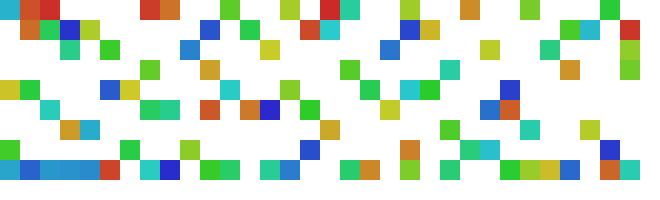

# MAPFUA - Multi-Agent Path Finding with Unassigned Agents

## A research framework for Multi-Agent Path Finding with Assigned and Unassigned Agents

[](https://github.com/J-morag/MAPF_dev/actions/workflows/CI-tests.yml)
 [Continuous Benchmark](https://j-morag.github.io/MAPF_dev/dev/bench/master/)



---

## Overview

This project is a research-oriented implementation of **MAPFUA**:
**Multi-Agent Path Finding with Unassigned Agents**.

MAPFUA is a variant of the classical **Multi-Agent Path Finding (MAPF)** problem.

In classical MAPF, every agent has:

* a start location,
* a goal location,
* and the task of finding a collision-free path from its start to its goal.

In MAPFUA, the environment also contains agents that do not have an assigned task. These agents are called **Unassigned Agents (UA)**.

The agents are divided into two types:

* **Assigned Agents (AA)** — regular MAPF agents that have a real goal and must reach it.
* **Unassigned Agents (UA)** — agents without a task. Their start location is also treated as their target location.

Instead of treating unassigned agents as static obstacles, this project investigates whether allowing them to move can improve the solution for the assigned agents.

The main research question is:

> Can unassigned agents actively move in order to reduce interference and help assigned agents reach their goals more efficiently?

This setting is motivated by real-world multi-agent systems such as:

* warehouse robots,
* autonomous parking systems,
* robotic fulfillment centers,
* and other environments where not every robot is actively assigned to a task at every moment.

---

## MAPFUA Formulation

A MAPFUA instance contains:

* a graph or grid map,
* static obstacles,
* a set of assigned agents,
* a set of unassigned agents.

Each **Assigned Agent (AA)** has:

```text
start != goal
```

Each **Unassigned Agent (UA)** has:

```text
start == goal
```

The UA is considered to have already reached its target at time `t = 0`, but it may still move afterward if doing so helps the global solution.

The solution must remain conflict-free:

* no two agents may occupy the same vertex at the same timestep,
* no two agents may traverse the same edge in opposite directions at the same timestep.

---

## Dynamic UA vs Static UA

This project supports two ways of handling unassigned agents:

### Dynamic UA

In this setting, unassigned agents are treated as real agents that may move.

They can clear paths, reduce congestion, and help assigned agents reach their goals faster or with lower cost.

### Static UA

In this setting, unassigned agents are treated as static obstacles.

They do not move and simply block their initial locations.

This mode is useful as a baseline for comparing whether dynamic unassigned agents improve performance.

---

## Cost Functions

The project currently supports several cost functions for evaluating MAPFUA solutions.

### SST — Sum of Service Times

This objective focuses on the assigned agents.

The goal is to minimize the total time until assigned agents reach their goals.

This setting models cases where the most important objective is to serve the assigned agents as quickly as possible, while allowing unassigned agents to move if needed.

### FUEL

This objective minimizes the total number of movement actions.

In this setting:

* moving costs `1`,
* waiting costs `0`.

This objective models cases where movement itself is expensive, for example due to battery usage, energy consumption, or mechanical wear.

### NUA — Number of Unassigned Agents

This objective gives high priority to minimizing unnecessary UA movement.

The goal is to prefer solutions in which as few unassigned agents as possible move.

This is useful when moving idle agents is allowed, but should only happen when it is actually beneficial.

The objective is treated as a prioritized or weighted combination of:

1. minimizing the number of UAs that move,
2. minimizing movement cost,
3. minimizing assigned-agent service time.

---

## Algorithms

This codebase is based on a general MAPF framework and includes several MAPF algorithms and variants.

For the MAPFUA research, the main relevant algorithms are:

* **A*** — low-level single-agent path planning.
* **CBS** — Conflict-Based Search.
* **A* + OD** — A* with Operator Decomposition.
* **LaCAM** — Lazy Constraints Addition Search.

The implementation includes adaptations needed for MAPFUA, including support for assigned and unassigned agents, dynamic UA movement, static UA baselines, and MAPFUA-specific cost functions.

---

## Getting Started

### Requirements

* JDK 18 or higher for compiling and running the main application.

  * JRE 18 or higher is sufficient for running a pre-built jar file.
* Maven 3.6+ for building the project.

---

## Running the Project Using the CLI

To see all available command-line options, run:

```bash
java -jar MAPF.jar -h
```

Or, if running directly from the source code, run the main function with:

```bash
-h
```

Example command for solving all instances in a directory with 10 agents:

```bash
-a 10 -iDir <instances_path>
```

Additional solver options can be selected using the `-s` flag.

For example, use the help command to see which solvers are currently available:

```bash
java -jar MAPF.jar -h
```

---

## Running Experiments from the Code

Experiments can also be configured directly from the Java code.

The main entry point is:

```text
Main.java
```

Examples are provided in:

```text
ExampleMain.java
```

To run custom experiments, you can use `GenericRunManager` or create a custom run manager that extends:

```text
Environment.RunManagers.A_RunManager
```

A custom run manager should define:

```java
setSolvers()
```

and:

```java
setExperiments()
```

### Choosing Solvers

Inside `setSolvers()`, add the solvers you want to run.

Example:

```java
solvers.add(new CBS_Solver());
```

### Defining Experiments

Inside `setExperiments()`, define the instances and experiment settings.

An experiment is created using:

```java
public Experiment(String experimentName, InstanceManager instanceManager, int numOfInstances)
```

where:

* `experimentName` is a unique name for the experiment,
* `instanceManager` controls how instances are loaded,
* `numOfInstances` controls how many instances to run.

---

## Creating a Single MAPFUA Instance

To create a single instance, use an `InstanceManager`.

An `InstanceManager` requires an instance builder, for example:

* `InstanceBuilder_MovingAI`
* `InstanceBuilder_BGU`

A single instance can be loaded using:

```java
A_RunManager.getInstanceFromPath(...)
```

The method signature is:

```java
public static MAPF_Instance getInstanceFromPath(
    InstanceManager manager,
    InstanceManager.InstancePath absolutePath
)
```

---

## Instance Format

The default supported instance format is based on the MovingAI MAPF benchmark format.

The project also supports additional internal builders used for research experiments.

For MAPFUA experiments, instances should distinguish between:

* assigned agents,
* unassigned agents.

A UA is represented as an agent whose source and target are the same location.

Conceptually:

```text
Assigned Agent:
source != target

Unassigned Agent:
source == target
```

---

## Output and Reports

Experiment outputs may include:

* solver name,
* instance name,
* solved / failed status,
* elapsed runtime,
* timeout threshold,
* high-level expanded nodes,
* low-level expanded nodes,
* number of assigned agents,
* number of unassigned agents,
* assigned-agent movement and waiting,
* unassigned-agent movement and waiting,
* SST cost,
* FUEL cost,
* NUA cost,
* makespan.

The exact report fields can be modified in the experiment report configuration.

---

## Research Purpose

The purpose of this project is not only to solve standard MAPF instances, but to investigate how idle or unassigned agents should behave in shared environments.

In many real-world systems, idle agents are not simply obstacles. They are physical entities that can move, wait, or reposition themselves.

This project studies when and how these agents should move in order to improve the overall system performance.

The main comparison is usually between:

* treating UAs as static obstacles,
* allowing UAs to move dynamically.

---

## News

* 2025-02: Added selecting solvers as a command-line argument.
* 2024-07: Added LaCAM algorithm.
* 2024-04: Added PCS algorithm.

---

## Acknowledgements

This project is based on the MAPF development framework originally designed by Jonathan Morag and Yonatan Zax.

The original framework started in 2019 at the Heuristic Search Group, Department of Software and Information Systems Engineering, Ben-Gurion University of the Negev.

This MAPFUA version extends the framework for research on Multi-Agent Path Finding with Unassigned Agents.

### Algorithmic References

Conflict-Based Search (CBS) is based on:

* Sharon, G., Stern, R., Felner, A., & Sturtevant, N. R. (2015).
  Conflict-based search for optimal multi-agent pathfinding.
  Artificial Intelligence, 219, 40-66.

* Li, J., et al. (2020).
  New techniques for pairwise symmetry breaking in multi-agent path finding.
  Proceedings of the International Conference on Automated Planning and Scheduling.

Increasing Cost Tree Search (ICTS) is based on:

* Sharon, G., et al. (2013).
  The increasing cost tree search for optimal multi-agent pathfinding.
  Artificial Intelligence, 195, 470-495.

* Sharon, G., et al. (2011).
  Pruning techniques for the increasing cost tree search for optimal multi-agent pathfinding.
  Fourth Annual Symposium on Combinatorial Search.

Prioritised Planning is based on:

* Silver, D. (2005).
  Cooperative pathfinding.
  Proceedings of the AAAI Conference on Artificial Intelligence and Interactive Digital Entertainment.

* Andreychuk, A., & Yakovlev, K. (2018).
  Two techniques that enhance the performance of multi-robot prioritized path planning.
  arXiv preprint arXiv:1805.01270.

Large Neighborhood Search (LNS) is based on:

* Li, J., et al. (2021).
  Anytime multi-agent path finding via large neighborhood search.
  Proceedings of the International Joint Conference on Artificial Intelligence.

Priority Inheritance with Backtracking (PIBT) is based on:

* Okumura, K., et al. (2022).
  Priority inheritance with backtracking for iterative multi-agent path finding.
  Artificial Intelligence, 310.

Lazy Constraints Addition Search (LaCAM) is based on:

* Okumura, K. (2023).
  Improving LaCAM for scalable eventually optimal multi-agent pathfinding.
  arXiv preprint arXiv:2305.03632.

Priority Constrained Search (PCS) is based on:

* Morag, J., et al. (2024).
  Prioritised Planning with Guarantees.
  Proceedings of the International Symposium on Combinatorial Search.

Safe Interval Path Planning (SIPP) is based on:

* Phillips, M., & Likhachev, M. (2011).
  SIPP: Safe Interval Path Planning for Dynamic Environments.
  IEEE International Conference on Robotics and Automation.
